# Mermaid

Mermaid creates diagrams in markdown.  I want to get quick with Mermaid so my md files are more valuable.  Changed!

Test the diagram in the official Mermaid Live [Editor](https://mermaid.live/)

https://mermaid.live/

## Examples

### Top Down


### Bottom-Top
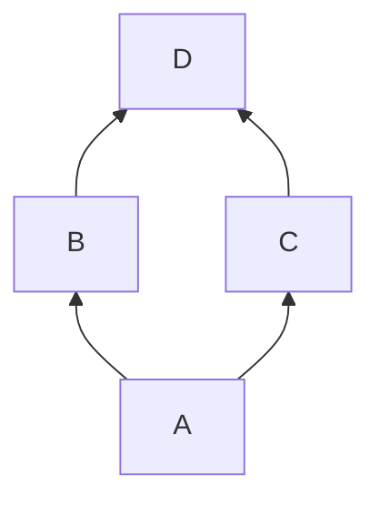

### Left-Right
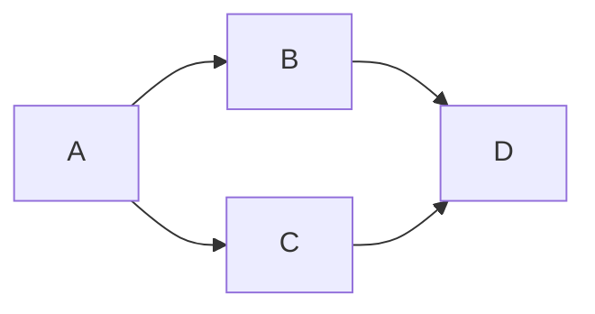


### Right-Left
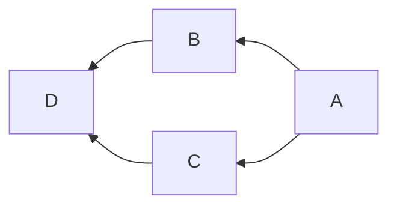

### gitGraph

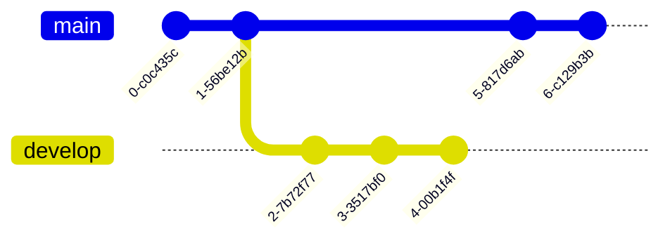

Huh - try to contreol it.  

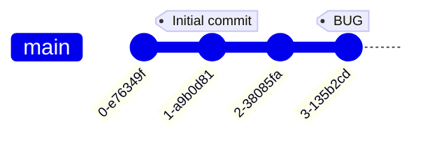


## Mermaid Chart

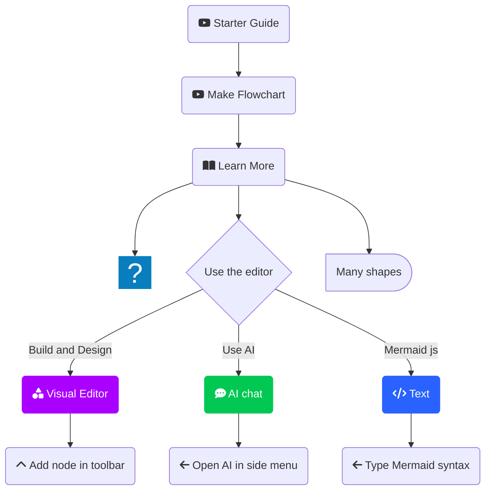

## Sankey

```mermaid
sankey
    A[Source] --> B[Target] : 10
    A --> C[Other Target] : 5
    B --> D[Final] : 7
    C --> D : 3
```

## Quadrant

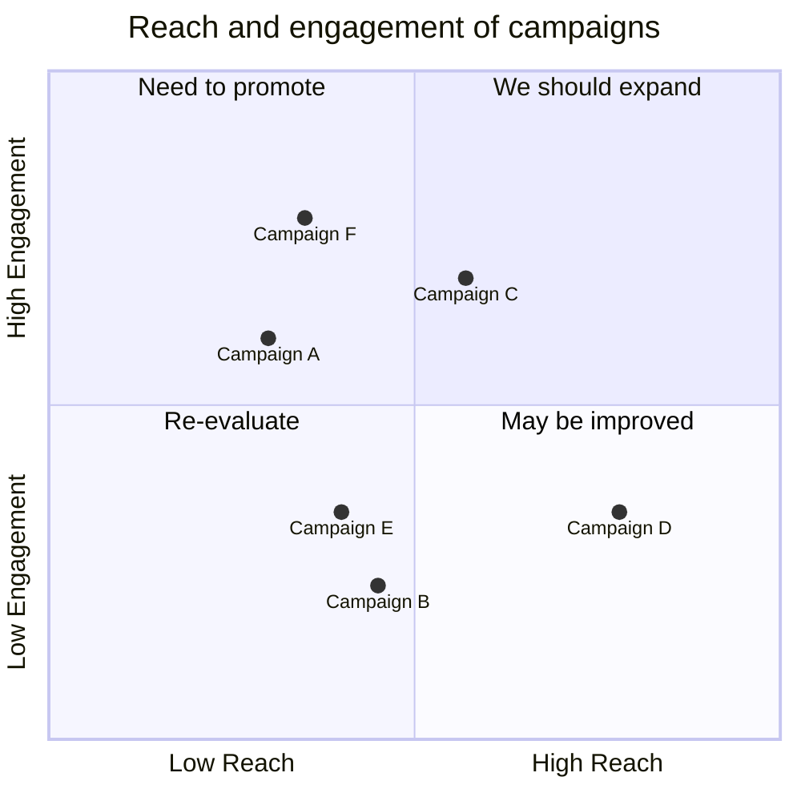

## erDiagram

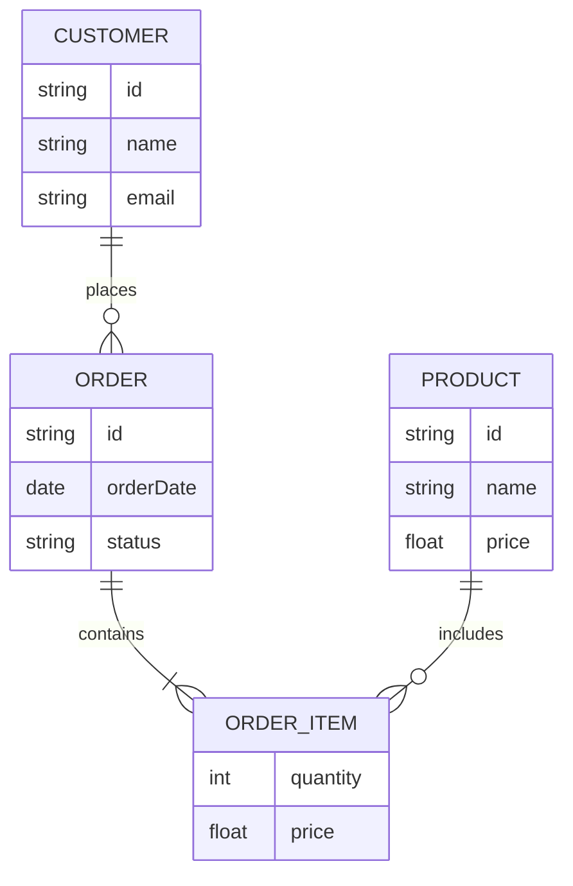

## Mindmap

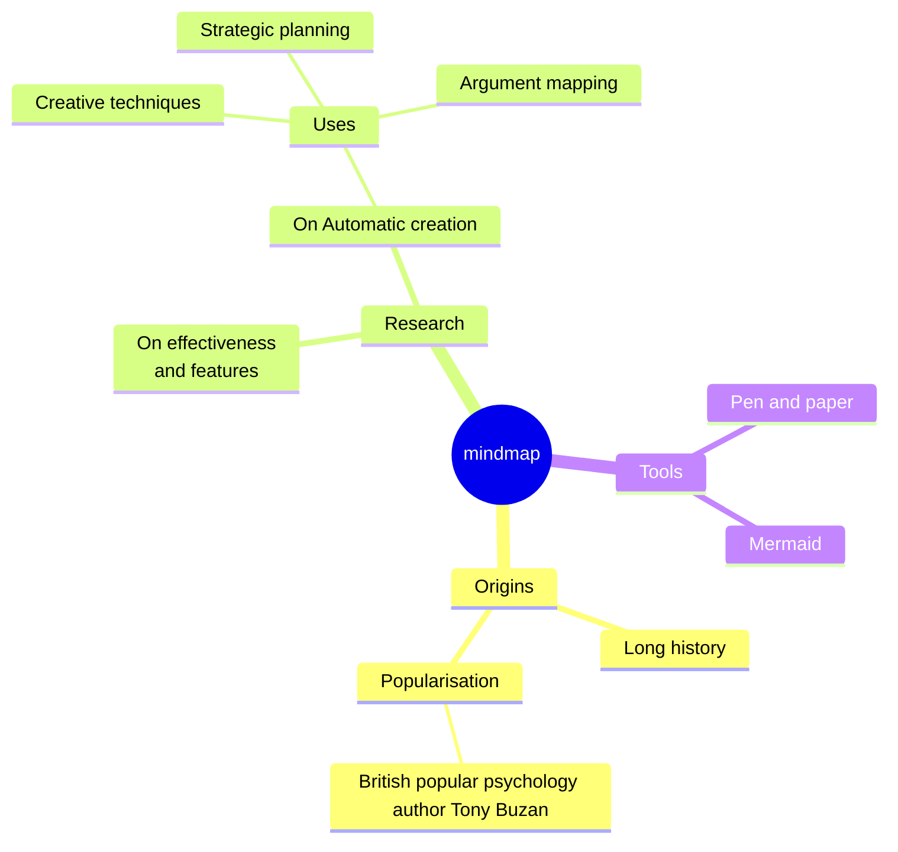

## Gantt
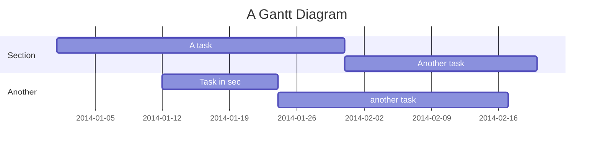


## Kanban
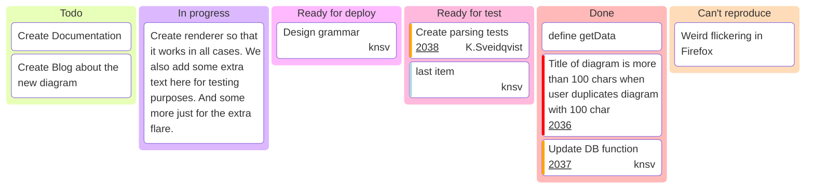

## Packet

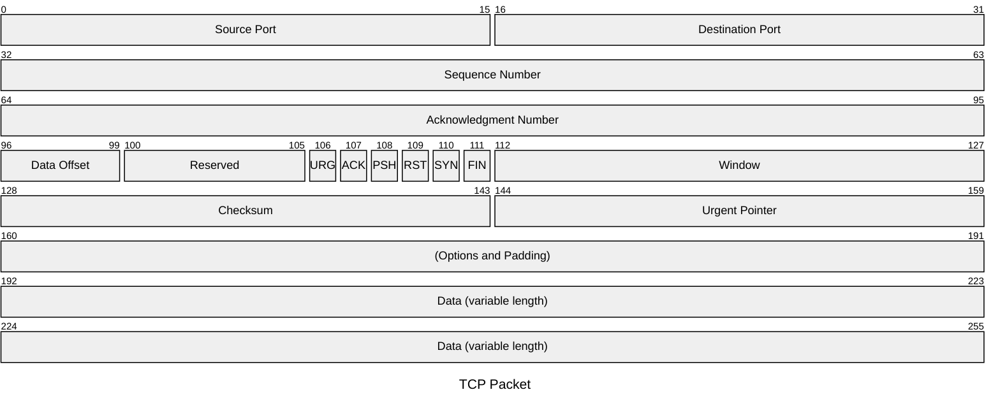

## Requirement
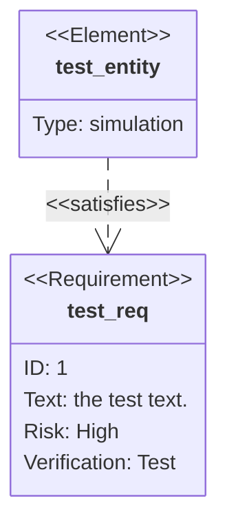

## Treemap
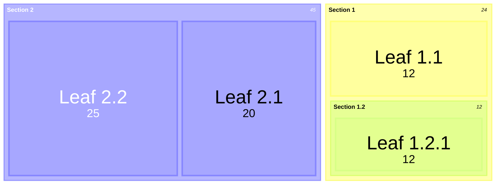

## Journey

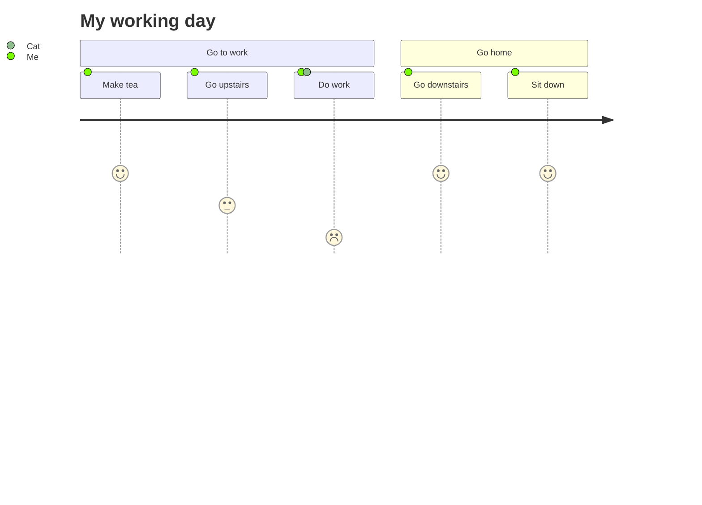


## XY
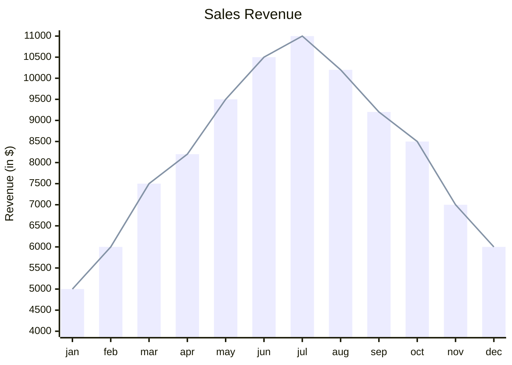

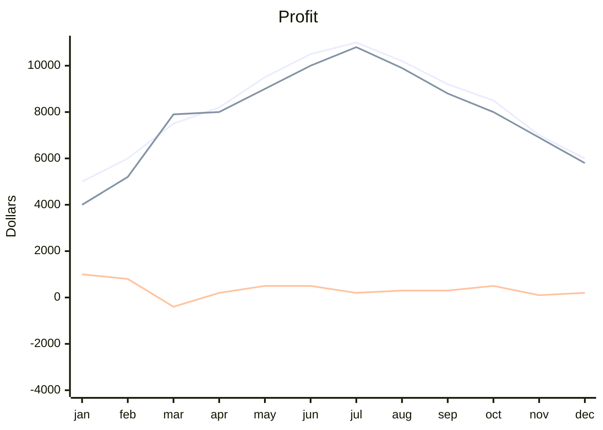


## Zenuml

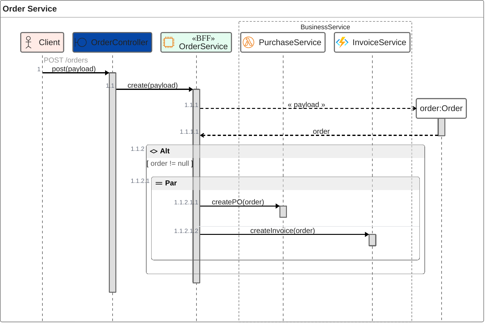


```mermaid
zenuml
    title Order Service
    @Actor Client #FFEBE6
    @Boundary OrderController #0747A6
    @EC2 OrderService #14b260ff
    group BusinessService {
      @Lambda PurchaseService
    }

    @Starter(Client)
    // `POST /orders`
    OrderController.post(payload) {
      OrderService.create(payload) {
        order = new Order(payload)
      }
    }
    
```